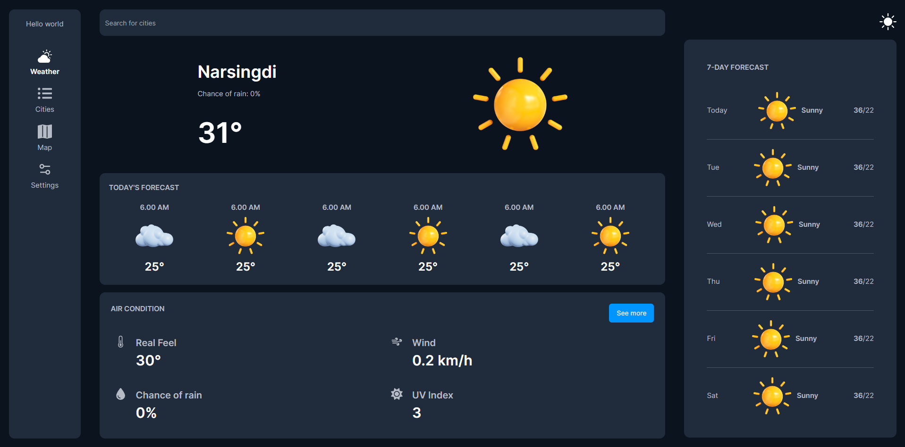

# Weather Application


A simple and responsive weather application built with React, React Icons, and Tailwind CSS. Get real-time weather information for your location or any other city around the world.

## Features
* View current weather conditions, including temperature, humidity, wind speed, and more.
* Search for weather information in any city globally.
* Responsive design for desktop and mobile devices.
* Uses the OpenWeatherMap API to fetch weather data.

## Demo
You can see a live demo of the application here: Weather App Demo

## Getting Started
Follow these instructions to get a copy of the project up and running on your local machine.

### Prerequisites
You need to have Node.js and npm (Node Package Manager) installed on your computer.

* Node.js
* npm

### Installation
1. Clone the repository to your local machine: <br>
<code>git clone https://github.com/your-username/weather-app.git </code>
2. Change to the project directory: <br>
   <code>cd weather-app/ui</code>
3. Install the project dependencies:
<code>npm install</code>

### Configuration
To fetch weather data, you need to obtain an API key from OpenWeatherMap. Create a .env file in the project root directory and add your API key:
```REACT_APP_OPENWEATHERMAP_API_KEY=your-api-key```

### Usage
```npm run dev```

Open your web browser and go to http://localhost:5173 to view the application.

### Built With
* React - JavaScript library for building user interfaces.
* React Icons - A library for including popular icons in React applications. 
* Tailwind CSS - A utility-first CSS framework.

### API Reference
This project uses the OpenWeatherMap API to fetch weather data. You will need to sign up for a free API key to use it.

### Contributing
Contributions are welcome! Please read the Contributing Guidelines for details.

### License
This project is licensed under the MIT License - see the LICENSE file for details.

### Acknowledgments
Special thanks to OpenWeatherMap for providing the weather data.

### Contact
If you have any questions or suggestions, please feel free to contact us:

Your Name - mdhsbaskari@gmail.com